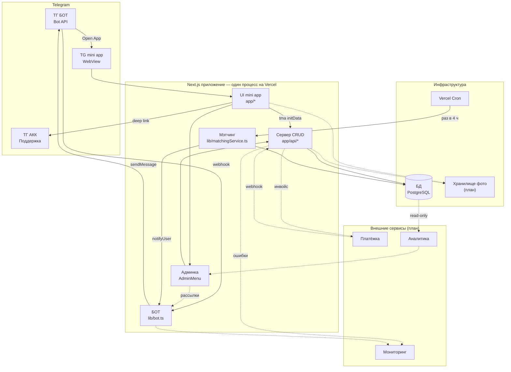
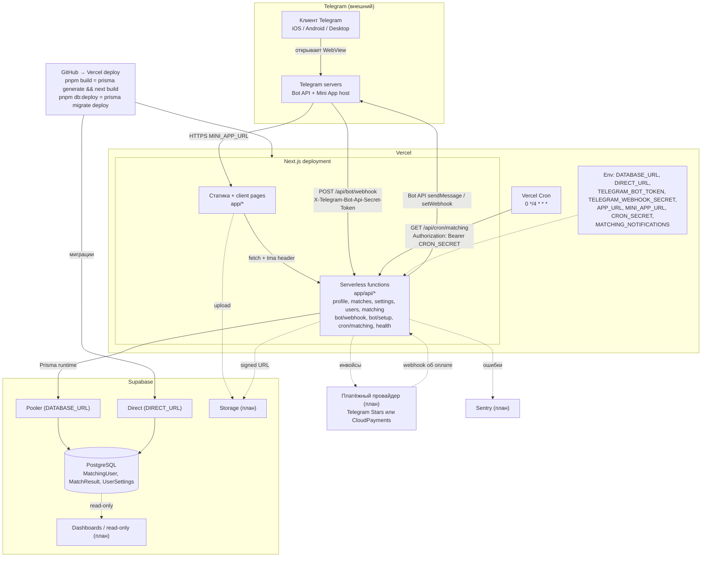

# Архитектура TravelMate

Две схемы одной системы: **логическая** (какие компоненты есть и кто с кем
общается) и **деплойная** (где это физически крутится). Сверено с кодом на
ветке `feature/platform-upgrade` (2026-10-07). Пунктиром отмечено то, чего в
коде ещё нет и что только планируется.

Легенда для обеих схем:

- сплошная линия — связь есть в коде сейчас;
- пунктирная линия и `(план)` в подписи — планируемый компонент или связь;
- стрелка показывает, кто инициирует вызов, а не только куда текут данные.

## 1. Логическая схема

### Что здесь важно

**Next.js — это один процесс.** UI mini app, CRUD‑роуты, grammY‑бот и
матчинг живут в одном приложении. На схеме они разнесены по коробкам только
как логические модули. Граница между ними — импорты: серверные модули
(`lib/prisma.ts`, `lib/auth.ts`, `lib/bot.ts`, `lib/matchingService.ts`)
никогда не импортируются из клиентских компонентов.

**Два входа из Telegram, оба инициирует Telegram.**

- Mini app: пользователь открывает WebView, клиент получает `initDataRaw` и
  передаёт его в каждый запрос как `Authorization: tma <initData>`. Сервер
  проверяет подпись токеном бота в `lib/auth.ts` и никогда не доверяет id из
  тела или URL.
- Бот: Telegram сам вызывает `/api/bot/webhook` с `TELEGRAM_WEBHOOK_SECRET`.
  Это единственный способ получить апдейт, long polling на Vercel не работает.

**Матчинг запускает cron, а не CRUD.** Vercel Cron раз в 4 часа дёргает
`GET /api/cron/matching` с `CRON_SECRET`. Матчинг читает `MatchingUser`,
пишет `MatchResult` и, если включён `MATCHING_NOTIFICATIONS`, через
`notifyUser()` пишет обоим участникам. Поэтому на схеме есть стрелка
Мэтчинг → БОТ, которой не было в первом наброске.

**Админка не ходит в Telegram напрямую.** Всё, что админка хочет отправить
пользователям, идёт через `lib/bot.ts`. Так токен бота и обработка лимитов
Telegram остаются в одном месте. Сейчас админка — это `AdminMenu` на `/` плюс
admin‑only роуты; отдельного сервиса нет и пока не нужен.

**Поддержка — deep link.** Mini app просто открывает чат с аккаунтом
поддержки, никакой интеграции не требуется.

### Планируемые компоненты

| Компонент | Зачем | Что надо учесть |
|---|---|---|
| Хранилище фото | `MatchingUser.photo` сейчас просто строка, `PhotoUpload` ничего не отправляет | Supabase Storage или S3. Загрузка с клиента по signed URL, в БД хранится только путь |
| Платёжка | Подписка на `/settings/subscription`, сейчас заглушка «всё бесплатно» | Цифровые услуги внутри Mini App по правилам Telegram оплачиваются только через Telegram Stars. CloudPayments допустим только с внешней страницы, куда ведёт ссылка из бота. В любом случае источник правды о подписке — БД, обновляется по webhook от платёжки |
| Аналитика | Воронка онбординга, количество матчей, активность | Metabase или дашборды Supabase поверх той же БД в read‑only режиме. Свою аналитику в приложении не писать |
| Мониторинг | Ошибки webhook‑бота сейчас просто теряются | Sentry плюс логи Vercel. Лог‑формат уже есть: emoji‑префикс, одна строка |
| Очередь для рассылок | Bot API отдаёт примерно 30 сообщений в секунду | Понадобится при рассылках из админки или при росте базы. До этого хватит батчинга с паузой |

Отдельный долг: конфиг матчинга, который правится через `PUT /api/matching`,
живёт в памяти и сбрасывается при деплое. Если админка будет его менять,
его место в БД.

## 2. Деплойная схема

### Что здесь важно

**Снаружи всего три системы: Telegram, Vercel, Supabase.** Всё, что в
первом наброске выглядело как отдельные сервисы, на деле — serverless‑функции
одного деплоя на Vercel. Это дёшево и просто, но накладывает ограничения:

- нет долгоживущего процесса, поэтому бот только в webhook‑режиме, а
  матчинг только по cron;
- состояние в памяти не переживает деплой и не разделяется между функциями
  (отсюда долг по конфигу матчинга);
- длительные задачи упираются в таймаут функции, большая рассылка должна
  быть разбита на батчи или уходить во внешнюю очередь.

**Два подключения к Postgres.** Runtime ходит через pooler
(`DATABASE_URL`), миграции через прямое подключение (`DIRECT_URL`).
`lib/prisma.ts` во время `next build` без `DATABASE_URL` отдаёт no‑op
прокси, в рантайме каждому DB‑роуту нужен реальный URL.

**Публичные роуты.** Без `tma`‑авторизации доступны только `/api/health`,
`/api/bot/webhook` (защищён секретом вебхука) и `/api/cron/*` (защищён
`CRON_SECRET`). Всё остальное требует валидного init data, admin‑роуты
дополнительно проверяют `ADMIN_TELEGRAM_IDS`.

**Деплой.** GitHub → Vercel. `pnpm build` генерирует Prisma‑клиент и собирает
Next.js, миграции накатываются отдельно через `pnpm db:deploy`. После первого
деплоя webhook регистрируется вручную через `POST /api/bot/setup` на
`${APP_URL}/api/bot/webhook`. Подробности в `docs/DEV_WORKFLOW.md`.

**Что добавится при росте.** Supabase Storage для фото и Supabase‑дашборды
для аналитики не требуют нового провайдера, они в том же проекте. Платёжка
и Sentry — новые внешние системы, у каждой свои секреты в env и свой
входящий webhook в `app/api/*`.

## Связанные документы

- `docs/DATA_AND_API.md` — схема Prisma, auth, все роуты, алгоритм матчинга
- `docs/DEV_WORKFLOW.md` — запуск, БД, бот и webhook, деплой
- `docs/KNOWN_ISSUES.md` — техдолг, включая конфиг матчинга в памяти
